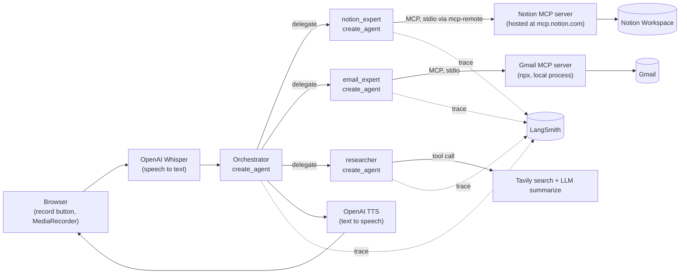
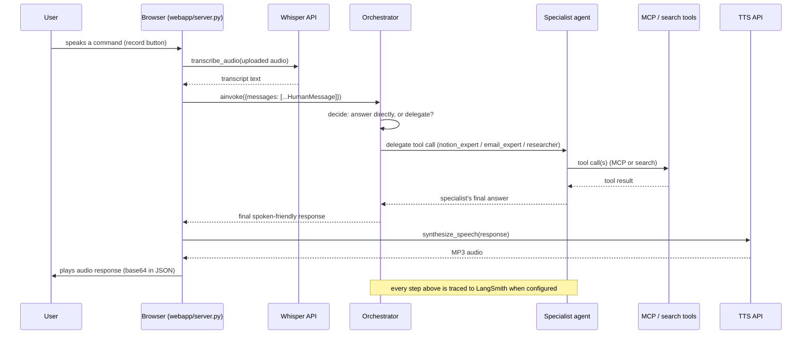
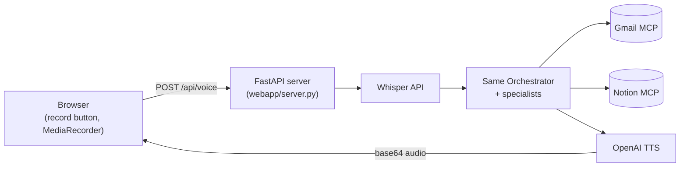

# LangChain Voice Agent for Gmail + Notion

A voice-controlled executive assistant, built with LangChain's `create_agent`
and the OpenAI API, that takes spoken commands and acts on your real Gmail
inbox and Notion workspace — checking email, drafting and sending replies,
researching a topic on the web, and writing the results into Notion pages.

It's a **multi-agent system**: a generalist Orchestrator answers plain
questions itself and delegates anything Gmail-, Notion-, or research-shaped
to a specialist sub-agent that owns just that one job.

```
Orchestrator -> notion_expert  (Notion MCP tools)
             -> email_expert   (Gmail MCP tools)
             -> researcher     (web search + summarize)
```

Gmail and Notion aren't wired up as hand-rolled API clients — each
specialist reaches its service over the **Model Context Protocol (MCP)**: a
local Gmail MCP server (`@gongrzhe/server-gmail-autoauth-mcp`) and Notion's
official hosted MCP server (`mcp.notion.com`, via the `mcp-remote` stdio
bridge). Each authenticates itself once via a cached OAuth token.

Every agent/tool call is traced to **LangSmith** when configured, so you can
see exactly which specialist handled a request and what it did.

This repo is the companion code for a type-along video tutorial. See
[tutorial.md](tutorial.md) for the step-by-step teaching script.

## What it does

- **"What's the latest unread message in my inbox?"**
  → reads your Gmail inbox via the Gmail MCP tools.
- **"Draft a reply to that saying I'll follow up Monday."**
  → drafts a reply and reads it back to you before sending (the agent is
  instructed to always confirm before actually sending).
- **"Research the pros and cons of server-side rendering and save it to Notion."**
  → searches the web, summarizes the findings, and creates a new Notion page.
- **"Search my Notion workspace for anything about pricing."**
  → uses the Notion MCP tools to search and read back matches.

## Architecture



## Request lifecycle (one voice turn)



## Project layout

```
voice_notion_agent/
├── config.py             # env var loading + validation
├── mcp_client.py         # MultiServerMCPClient config for Gmail + Notion
├── stt.py                # OpenAI Whisper transcription
├── tts.py                # OpenAI TTS synthesis
├── agent.py              # Orchestrator: builds specialists, delegates via tools
├── agents/
│   ├── notion_expert.py    # specialist: Notion MCP tools only
│   ├── email_expert.py     # specialist: Gmail MCP tools only
│   └── researcher.py       # specialist: web search + summarize
└── tools/
    └── research_tool.py  # web search (Tavily) + LLM summarization

webapp/
├── server.py            # FastAPI app: browser mic -> STT -> agent -> TTS
└── static/index.html    # single-page UI (record button + text fallback)

Dockerfile               # Python + Node.js (MCP servers run via npx)
render.yaml              # Render Docker-based web service config
```

## Setup

0. **Prerequisites:** Python 3.11 or 3.12 (LangChain has known typing issues
   on very new releases like 3.14), and **Node.js 18+** (the Gmail and
   Notion MCP servers are launched via `npx`).

1. Create and activate a virtual environment, then install dependencies:

   ```bash
   python3.12 -m venv .venv
   source .venv/bin/activate
   pip install -r requirements.txt
   ```

2. Copy `.env.example` to `.env` and fill in:
   - `OPENAI_API_KEY` — from https://platform.openai.com/api-keys
   - `TAVILY_API_KEY` — from https://app.tavily.com (used by the
     `research_topic` tool for web search)

   Those are the only required secrets in `.env` — Gmail and Notion
   authenticate themselves separately, below.

3. **One-time Gmail auth:**
   - In Google Cloud Console, create an OAuth client of type
     **"Web application"** with redirect URI
     `http://localhost:3000/oauth2callback`.
   - Download it, rename it to `gcp-oauth.keys.json`, and put it at
     `~/.gmail-mcp/gcp-oauth.keys.json`.
   - Run once: `npx @gongrzhe/server-gmail-autoauth-mcp auth` — a browser
     opens for Google login, and a token is cached at
     `~/.gmail-mcp/credentials.json`.

4. **One-time Notion auth:**
   - Run once: `npx -y mcp-remote https://mcp.notion.com/mcp` — a browser
     opens for a Notion OAuth consent screen, and a token is cached under
     `~/.mcp-auth/`.
   - Don't use the older `@notionhq/notion-mcp-server` package — it's
     deprecated and its token-based auth 400s on tool calls now.

5. Run the web app (see [Browser demo + deployment](#browser-demo--deployment)
   below):

   ```bash
   uvicorn webapp.server:app --reload --port 8000
   ```

   Open http://localhost:8000, hold the record button, and speak a
   command — mic capture and playback happen entirely in the browser via
   `MediaRecorder`/`<audio>`, so no local audio device setup is needed.

## Notes on platform quirks

- The Gmail/Notion tokens cached at `~/.gmail-mcp/` and `~/.mcp-auth/` are
  tied to the machine that ran the one-time auth commands — they don't
  travel with the repo, and shouldn't be committed to it.

## Observability (LangSmith)

Every agent and tool call — the Orchestrator's routing decision, each
specialist's own reasoning, every MCP tool call — is traced automatically
once these are set in `.env` (see `.env.example`):

```
LANGSMITH_TRACING=true
LANGSMITH_ENDPOINT=https://api.smith.langchain.com
LANGSMITH_API_KEY=lsv2_...
LANGSMITH_PROJECT=voice-agent-demo
```

No code wires this up explicitly — `langsmith`'s tracing is picked up from
these env vars automatically by every LangChain call, as long as they're
set before the first request (`config.py`'s `load_dotenv()` at import time
takes care of that). Leave them unset and tracing is simply off.

With tracing on, open your project at https://smith.langchain.com and a
single voice command shows up as one nested trace: the Orchestrator's
`LangGraph` run, its decision of which specialist to call, that
specialist's own run and tool calls, all the way down — useful both for
debugging ("why did it call email_expert instead of notion_expert?") and
for showing the multi-agent routing on screen during a demo.

## Browser demo + deployment

There's a small FastAPI web app in `webapp/` that fronts the same agent
and tools with a browser record button — no local mic/speaker setup
required, since capture and playback both happen in the browser.



Run it locally first (after completing the Gmail/Notion one-time auth above
on this machine):

```bash
uvicorn webapp.server:app --reload --port 8000
```

Open http://localhost:8000, hold the record button, speak a command, and
it plays the spoken reply back in the browser tab.

### ⚠️ Before exposing this publicly

This version has real Gmail read/send access. **Set `AUTH_PASSWORD` before
this service is reachable on a public URL** — without it, anyone with the
link can read your inbox or send mail as you. When set, every route
(including the page itself, not just the API calls) requires HTTP Basic
Auth: the browser's native login prompt, checked against
`AUTH_USERNAME`/`AUTH_PASSWORD` (username defaults to `demo`). There's
nothing to forward manually — visiting the URL just prompts for
credentials, and the browser remembers them for the session. Recording
locally and screen-sharing is still the simplest option if you don't need
a live shareable link at all.

### Why not Vercel

Vercel's Python runtime is serverless functions with a hard execution
timeout (10s on the free/hobby tier). A single voice turn here can chain
Whisper transcription → an MCP tool-calling loop → a live web search →
another LLM summarization call → TTS synthesis, which routinely takes
longer than that, especially on a cold start with LangChain's dependency
weight. It's a poor fit for this kind of pipeline, on top of not running a
Node.js sidecar process for the MCP servers at all. `Dockerfile` +
`render.yaml` in this repo target Render instead — a normal, persistent
Python+Node.js container with no per-request timeout.

### Deploying to Render (free tier)

The Gmail/Notion MCP tokens at `~/.gmail-mcp/` and `~/.mcp-auth/` only
exist on the machine that ran the one-time logins, and Render's disk is
ephemeral (wiped on every restart/redeploy) — so they need to be restored
into the container on every boot. `docker-entrypoint.sh` does that from
two base64 env vars, and `scripts/pack_mcp_tokens.py` generates them:

1. On the machine where you completed the Gmail and Notion one-time
   logins, run:

   ```bash
   python scripts/pack_mcp_tokens.py
   ```

   This prints two base64 blobs. **Treat them like passwords** — they are
   your real Gmail/Notion session credentials. Don't commit them or paste
   them anywhere but Render's env var fields.

2. Push this repo to GitHub (the blobs are not part of the repo — you
   paste them directly into Render in the next step).
3. In Render, "New +" → "Web Service" → connect the repo. Render detects
   `render.yaml` and builds from the `Dockerfile`.
4. In the Render dashboard, set the environment variables `render.yaml`
   marks `sync: false`:
   - `OPENAI_API_KEY`, `TAVILY_API_KEY`
   - `GMAIL_MCP_TAR_B64`, `MCP_AUTH_TAR_B64` — the two blobs from step 1
   - `AUTH_PASSWORD` (and optionally `AUTH_USERNAME`) — see the warning
     above; required before sharing the URL with anyone
   - `LANGSMITH_API_KEY`, if you want tracing from the deployed instance too
5. Deploy. Render gives you a `https://<name>.onrender.com` URL — mic
   access requires HTTPS in the browser, which Render provides by default.

**Free-tier caveat for recording:** Render's free web services spin down
after ~15 minutes of inactivity and cold-start on the next request (tens
of seconds). Before hitting record on camera, load the URL once to warm
it up.

**If a token expires or is revoked:** Gmail/Notion tool calls will start
failing auth. Re-run the one-time login locally
(`npx @gongrzhe/server-gmail-autoauth-mcp auth` or
`npx -y mcp-remote https://mcp.notion.com/mcp`), re-run
`scripts/pack_mcp_tokens.py`, and update the corresponding env var on
Render.
