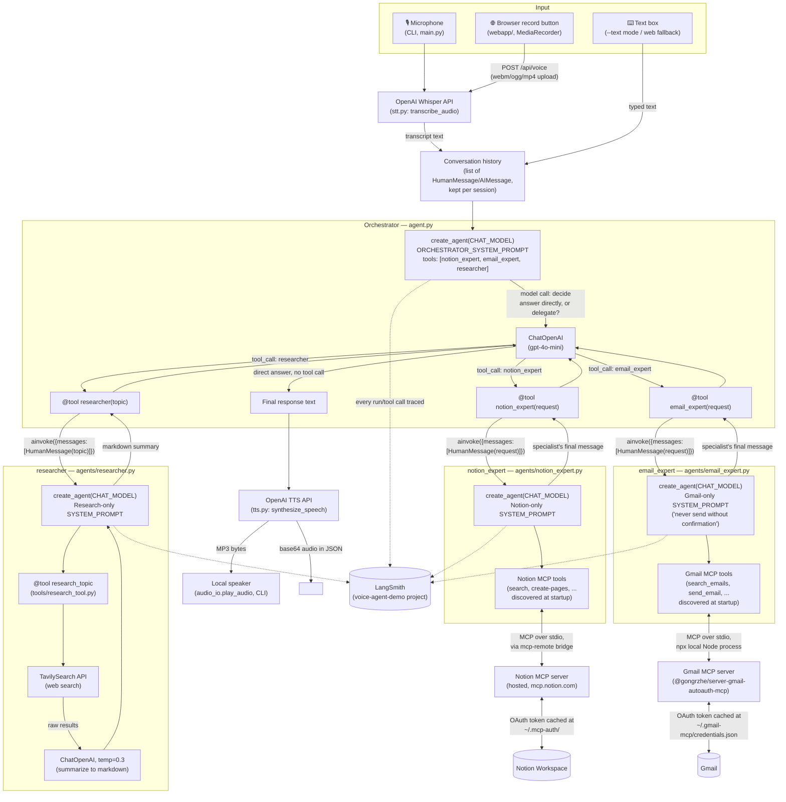
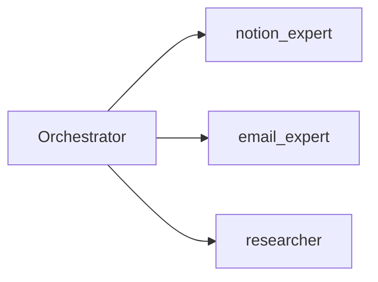

# Tutorial: Building a LangChain Voice Agent for Gmail + Notion

**Audience:** viewers comfortable with Python who have used an LLM API before,
but may be new to LangChain agents, tool calling, or MCP.

**Format:** type-along. Viewers build the project from an empty folder,
one file at a time, running something working after every section.

**Goal by the end:** say (or type) "What's the latest unread email in my
inbox?" / "Research X and save it to Notion" / "Search Notion for..." and
watch the agent reach into your real Gmail and Notion accounts to answer.
Sections 1-12 build a single agent that holds all the tools at once;
Section 13 is an optional capstone that splits it into an Orchestrator +
specialist sub-agents and adds LangSmith tracing.

Use this file as your recording script: each section has a **talking
point** (what to say to camera), **what to type**, and a **checkpoint**
(what to run to prove it works before moving on). Ship every checkpoint —
never leave the viewer without a runnable state.

---

## 0. Cold open (2 min)

Show the finished result first: run the app, say "Research the benefits of
cold showers and save it to Notion," then "What's the latest unread email
in my inbox?" and cut to both results — the created Notion page, and the
agent reading back a real email. This is the payoff clip — record it last,
but script it first so viewers know where they're headed.

Then show the full architecture diagram:



**Talking point:** "This looks like a lot more than 'record, transcribe,
reply, speak' — and it is, but every extra piece earns its place. Audio
comes in from either the CLI mic or the browser's record button and
becomes text via Whisper. That text, plus the running conversation
history, goes to the Orchestrator. The Orchestrator is itself a
`create_agent` whose only tools are three other agents wrapped as
functions — notice the diagram shows `notion_expert`, `email_expert`, and
`researcher` each as their own boxed-off `create_agent` with their own
system prompt and their own tools underneath. Only two of those three ever
touch MCP: Notion's specialist talks to Notion's hosted MCP server through
the `mcp-remote` bridge, Gmail's specialist spawns its own local MCP server
process via `npx` — both using an OAuth token that was cached to disk by a
one-time login, not anything passed around in our code. The researcher
doesn't need MCP at all; it's Tavily search plus one more LLM call to turn
raw results into a clean summary. Whatever the Orchestrator's final answer
is goes to OpenAI's TTS API and comes back as audio, played locally in the
CLI or streamed to the browser's `<audio>` tag. And running alongside all
of it, every one of those four agents reports its own trace to LangSmith,
so we can see this entire diagram play out for real, for one spoken
command, in a single nested view."

---

## 1. Project setup (5 min)

**Talking point:** "One extra prerequisite this time, beyond Python: Node.js.
The Gmail and Notion integrations both run as MCP servers launched with
`npx`, so we need Node installed alongside Python."

Type along:

```bash
mkdir langchain-voice-agent-tutorial && cd langchain-voice-agent-tutorial
python3.12 -m venv .venv
source .venv/bin/activate
node --version   # confirm Node 18+ is installed
```

Create `requirements.txt`:

```
langchain>=1.0,<2.0
langchain-openai>=1.0,<2.0
langchain-mcp-adapters>=0.3.0
openai>=1.40.0
python-dotenv>=1.0.1
sounddevice>=0.4.7
numpy>=1.26.0
langchain-tavily>=0.2.0
pydub>=0.25.1
```

**Talking point:** "Quick callout on `langchain` version — we're on the
1.0 line here, which shipped a new unified `create_agent` function built on
LangGraph. It replaces the older `create_openai_tools_agent` +
`AgentExecutor` pattern from 0.3.x. If you've seen tutorials using that
older API, this is the current, simpler way to build the same thing."

```bash
pip install -r requirements.txt
```

**Checkpoint:** `pip show langchain langchain-mcp-adapters | grep -E "Name|Version"` shows `langchain` 1.x and `langchain-mcp-adapters` installed.

---

## 2. Get your credentials (10-15 min)

**Talking point:** "Four things to set up before we write code: an OpenAI
key, a Tavily key for web search, a one-time Gmail login, and a one-time
Notion login. Only the OpenAI and Tavily keys go in our `.env` — Gmail and
Notion authenticate themselves and cache their own tokens on disk."

**OpenAI:** https://platform.openai.com/api-keys → create a key.

**Tavily:** https://app.tavily.com → create a key. This powers the
`research_topic` tool's web search — it's a search API built specifically
for feeding results to an LLM, which is why we're reaching for it instead
of scraping a search engine ourselves.

**Gmail** (via the community `@gongrzhe/server-gmail-autoauth-mcp` MCP server):

1. In Google Cloud Console, create an OAuth client of type **"Web
   application"**, redirect URI `http://localhost:3000/oauth2callback`.
2. Download it, rename to `gcp-oauth.keys.json`, save at
   `~/.gmail-mcp/gcp-oauth.keys.json`.
3. Run once:
   ```bash
   npx @gongrzhe/server-gmail-autoauth-mcp auth
   ```
   A browser opens for Google login; a token is cached at
   `~/.gmail-mcp/credentials.json`.

**Notion** (via Notion's official hosted MCP server at `mcp.notion.com`,
reached through the `mcp-remote` stdio bridge):

1. Run once:
   ```bash
   npx -y mcp-remote https://mcp.notion.com/mcp
   ```
   A browser opens for a Notion OAuth consent screen; a token is cached
   under `~/.mcp-auth/`.

**Talking point — a callout worth keeping in the video:** "Notion used to
ship a token-based open-source MCP server, `@notionhq/notion-mcp-server` —
don't reach for that one, it's deprecated and its tool calls now 400. The
hosted server at `mcp.notion.com` with browser OAuth is the current,
supported path."

Create `.env.example` and `.env`:

```
OPENAI_API_KEY=sk-...
TAVILY_API_KEY=tvly-...

CHAT_MODEL=gpt-4o-mini
STT_MODEL=whisper-1
TTS_MODEL=tts-1
TTS_VOICE=alloy
```

**Talking point:** "Notice there's no Notion or Gmail key in here at all —
that's the MCP model. Each server authenticates itself once, out of band,
and caches its own token. Our app never sees a Notion or Google secret
directly."

**Checkpoint:** none yet — we validate the OpenAI key next section, and
we'll prove the MCP logins worked once we wire up the agent in Section 6.

---

## 3. Config loading (5 min)

Create `voice_notion_agent/__init__.py` (empty) and
`voice_notion_agent/config.py`:

```python
"""Environment configuration for the voice agent.

Gmail and Notion are no longer authenticated via env vars in this file -
both are reached over MCP (see mcp_client.py), and each authenticates
itself using a token cached on disk by a one-time setup command. See
README.md / tutorial.md for that setup.
"""
import os

from dotenv import load_dotenv

load_dotenv()

OPENAI_API_KEY = os.getenv("OPENAI_API_KEY")
TAVILY_API_KEY = os.getenv("TAVILY_API_KEY")

CHAT_MODEL = os.getenv("CHAT_MODEL", "gpt-4o-mini")
STT_MODEL = os.getenv("STT_MODEL", "whisper-1")
TTS_MODEL = os.getenv("TTS_MODEL", "tts-1")
TTS_VOICE = os.getenv("TTS_VOICE", "alloy")


def validate() -> None:
    """Fail fast with a clear message if required secrets are missing."""
    missing = [
        name
        for name, value in [("OPENAI_API_KEY", OPENAI_API_KEY), ("TAVILY_API_KEY", TAVILY_API_KEY)]
        if not value
    ]
    if missing:
        raise RuntimeError(
            f"Missing required environment variables: {', '.join(missing)}. "
            "Copy .env.example to .env and fill them in."
        )
```

**Talking point:** "This got smaller than you might expect — just two
required variables, both for services we call directly (OpenAI, Tavily).
Gmail and Notion moved out of env-var land entirely because MCP handles
their auth for us."

**Checkpoint:**

```bash
python -c "from voice_notion_agent import config; config.validate()"
```

Should raise the missing-key error if `.env` isn't filled in yet, or
print nothing if it is.

---

## 4. Connecting to the Gmail and Notion MCP servers (10 min — the heart of the lesson)

**Talking point:** "Here's the core idea of MCP: instead of us writing a
Gmail API client and a Notion API client by hand, each service ships (or a
community maintainer ships) a small standalone server that exposes its
capabilities as tools over a standard protocol. Our job is just to tell
LangChain how to launch each server and let it discover what tools are
available — we never write `requests.get(...)` against either API
ourselves."

Create `voice_notion_agent/mcp_client.py`:

```python
"""MCP server connections for Gmail and Notion.

Both are reached over stdio, via a local Node process spawned through npx.
Neither takes credentials in this config - each authenticates itself using
a token cached on disk by a one-time interactive setup command that you
run yourself before starting the agent (see Section 2).
"""
from langchain_mcp_adapters.client import MultiServerMCPClient

mcp_client = MultiServerMCPClient(
    {
        "gmail": {
            "transport": "stdio",
            "command": "npx",
            "args": ["-y", "@gongrzhe/server-gmail-autoauth-mcp"],
        },
        "notion": {
            "transport": "stdio",
            "command": "npx",
            "args": ["-y", "mcp-remote", "https://mcp.notion.com/mcp"],
        },
    }
)
```

**Talking point:** "`MultiServerMCPClient` is from `langchain-mcp-adapters`
— it's the piece that knows how to spawn each server as a subprocess
(`transport: stdio`), talk MCP over its stdin/stdout, and turn whatever
tools it advertises into LangChain-compatible tool objects. `npx -y` means
'download and run this package if it's not already cached' — no manual
install step for either server."

**Checkpoint (proves both logins from Section 2 actually worked):**

```bash
python -c "
import asyncio
from voice_notion_agent.mcp_client import mcp_client

async def main():
    tools = await mcp_client.get_tools()
    for t in tools:
        print(t.name)

asyncio.run(main())
"
```

You should see a mix of Gmail tool names (things like `search_emails`,
`send_email`) and Notion tool names (things like `search`,
`create-pages`) printed. **This is a key teaching moment** — if this list
comes back empty or errors, it's an MCP auth or npx problem, not an agent
problem; debug it here before wiring up `create_agent` so you know which
half is broken later.

---

## 5. The research tool (10 min)

**Talking point:** "Gmail and Notion cover reading/writing those two
services, but 'research a topic on the web' isn't something either MCP
server does. This tool shows you don't have to get everything from MCP —
plain LangChain `@tool` functions sit in the same tools list right
alongside the MCP-discovered ones."

Create `voice_notion_agent/tools/__init__.py` (empty), then
`voice_notion_agent/tools/research_tool.py`:

```python
"""A web-research tool the agent can call before writing a Notion page."""
from langchain_core.tools import tool
from langchain_openai import ChatOpenAI
from langchain_tavily import TavilySearch

from .. import config

_llm = ChatOpenAI(model=config.CHAT_MODEL, api_key=config.OPENAI_API_KEY, temperature=0.3)
_search = TavilySearch(tavily_api_key=config.TAVILY_API_KEY, max_results=5)


@tool
def research_topic(topic: str) -> str:
    """Research a topic on the web and return a concise markdown summary.

    Use this before creating a Notion page whenever the user asks you to
    "research", "look into", or "find out about" something. The summary
    should then be passed as the content when creating the Notion page.
    """
    raw_results = _search.invoke({"query": topic})
    results_text = "\n".join(
        f"- {r['title']}: {r['content']}" for r in raw_results.get("results", [])
    )

    prompt = (
        "You are a research assistant. Using the raw search results below, "
        "write a concise, well-organized summary about the topic. Use short "
        "headings and bullet points. Keep it under 300 words.\n\n"
        f"Topic: {topic}\n\nRaw search results:\n{results_text}"
    )
    response = _llm.invoke(prompt)
    return response.content
```

**Talking point:** "Notice the docstring explicitly tells the agent to
follow this up by creating a Notion page. That's a deliberate nudge —
without it, smaller models sometimes just speak the research back to the
user instead of saving it. Docstrings are where you steer multi-step
behavior, whether the other tools involved come from MCP or not."

**Note for the recording:** `TavilySearch` from `langchain-tavily` is
already a proper `BaseTool` on its own — we could hand it to the agent
directly. We're wrapping it in our own `research_topic` tool instead so we
can add the summarization step: the agent gets back clean markdown ready
to drop into a Notion page, not a raw JSON blob of search results it has
to digest itself."

**Checkpoint:**

```bash
python -c "
from voice_notion_agent.tools.research_tool import research_topic
print(research_topic.invoke({'topic': 'benefits of cold showers'}))
"
```

Should print a short markdown summary.

---

## 6. Wiring the agent with `create_agent` (10 min)

**Talking point:** "Now we assemble everything: discover the MCP tools,
add our research tool, hand all of it plus a system prompt to
`create_agent`. This one function replaces the LLM + prompt template +
`AgentExecutor` dance from the older LangChain agent API — it builds a
small LangGraph agent for you."

Create `voice_notion_agent/agent.py`:

```python
"""Builds the LangChain agent that drives Gmail and Notion via MCP."""
from langchain.agents import create_agent

from . import config
from .mcp_client import mcp_client
from .tools.research_tool import research_topic

SYSTEM_PROMPT = """You are a voice-controlled executive assistant with access to the \
user's Gmail and Notion workspace over MCP, plus a web research tool.

You can:
- Check, search, and send email using the Gmail tools.
- Search, read, and create pages using the Notion tools.
- Research a topic on the web and write the findings into Notion \
(call research_topic first, then create a Notion page with its output).

Always give a short, spoken-friendly confirmation of what you did (1-2 sentences), \
since your reply may be read aloud. Never read out full email or page content \
verbatim unless asked; just confirm the action succeeded. Never send an email \
without repeating the draft back to the user first and getting confirmation.
"""


async def build_agent():
    """Discover the Gmail/Notion MCP tools and assemble them with the LLM."""
    mcp_tools = await mcp_client.get_tools()
    tools = [*mcp_tools, research_topic]
    return create_agent(config.CHAT_MODEL, tools=tools, system_prompt=SYSTEM_PROMPT)
```

**Talking point:** "A few things worth calling out: `build_agent` is
`async`, because discovering tools from an MCP server means starting that
server's subprocess and talking to it — that's inherently an async
operation. And notice `create_agent` takes the model as a plain string,
`config.CHAT_MODEL` — no need to construct a `ChatOpenAI` object yourself;
LangChain infers the provider from the model name."

"Also worth calling out in the system prompt: 'never send an email
without repeating the draft back to the user first.' Once an agent has
write access to your real inbox, that kind of guardrail in the prompt
matters — the model deciding to just fire off an email on a vague
instruction is a real failure mode worth guarding against explicitly."

**Checkpoint:**

```bash
python -c "
import asyncio
from voice_notion_agent.agent import build_agent

async def main():
    agent = await build_agent()
    print(type(agent))

asyncio.run(main())
"
```

Should print something like `<class 'langgraph.graph.state.CompiledStateGraph'>`
with no errors — that's the compiled agent, ready to invoke.

---

## 7. Text-mode loop first (5 min)

**Talking point:** "Before touching audio at all, let's prove the whole
agent pipeline end-to-end with plain text. This isolates three different
classes of bugs — MCP/auth bugs, agent/tool bugs, and audio bugs — so when
something breaks later, you already know which part to suspect."

Add a minimal `main.py` with just the text loop (we'll add voice next).
Note this whole file is `async` now, since `agent.ainvoke(...)` is:

```python
"""Entry point: voice or text loop that drives the Gmail/Notion MCP agent."""
import argparse
import asyncio

from langchain.messages import HumanMessage

from . import config
from .agent import build_agent

_MAX_HISTORY_MESSAGES = 20


async def run_text_loop() -> None:
    agent = await build_agent()
    messages: list = []
    print("Text mode Gmail/Notion Agent ready. Type 'exit' to quit.")
    while True:
        transcript = input("\nYou: ").strip()
        if transcript.lower() in {"exit", "quit"}:
            break
        if not transcript:
            continue

        messages.append(HumanMessage(content=transcript))
        result = await agent.ainvoke({"messages": messages})
        messages = result["messages"][-_MAX_HISTORY_MESSAGES:]
        print(f"Agent: {messages[-1].content}")


def main() -> None:
    parser = argparse.ArgumentParser(description="LangChain Gmail/Notion Voice Agent (MCP)")
    parser.add_argument("--text", action="store_true", help="Run in text-only mode.")
    args = parser.parse_args()

    config.validate()
    asyncio.run(run_text_loop())


if __name__ == "__main__":
    main()
```

**Talking point:** "Conversation history looks different from a classic
LangChain agent too — instead of a list of `(role, text)` tuples, we're
keeping a running list of `HumanMessage`/`AIMessage` objects, and each
call to `agent.ainvoke` returns the *entire* updated message list under
`result[\"messages\"]`, including whatever tool calls happened along the
way. We just slice off the last N to keep it bounded and carry it into the
next turn."

**Checkpoint — live demo moment:**

```bash
python -m voice_notion_agent.main --text
```

Type: `What's the latest unread email in my inbox?`

Watch it call the Gmail MCP tools and read back a real result. **This is
the first big payoff in the video** — the agent is genuinely reaching your
real inbox, just via keyboard for now.

Also try: `Research the pros and cons of standing desks and save it to Notion`
— this should chain `research_topic` → a Notion "create page" tool call,
a great moment to show two tool calls happening in sequence from one
instruction, one from a plain `@tool` function and one from MCP.

---

## 8. Speech-to-text (10 min)

**Talking point:** "Now the voice half. Two building blocks: record audio
from the mic, send it to Whisper. That's it — Whisper handles the actual
transcription, we're just plumbing. Nothing here changes because of the
MCP switch — this layer doesn't know or care how the agent gets its
tools."

Create `voice_notion_agent/audio_io.py`:

```python
"""Microphone recording and speaker playback helpers.

Recording and playback are both best-effort: on machines without an audio
device (e.g. some WSL2/CI setups) these functions degrade gracefully so the
rest of the pipeline (STT -> agent -> TTS) can still be exercised via files.
"""
import tempfile
import wave

import sounddevice as sd

SAMPLE_RATE = 16000
CHANNELS = 1


def record_audio(seconds: int = 5) -> str:
    """Record from the default microphone for a fixed duration.

    Returns the path to a temporary WAV file containing the recording.
    """
    print(f"Recording for {seconds} seconds... speak now.")
    recording = sd.rec(
        int(seconds * SAMPLE_RATE),
        samplerate=SAMPLE_RATE,
        channels=CHANNELS,
        dtype="int16",
    )
    sd.wait()
    print("Recording finished.")

    tmp_path = tempfile.mktemp(suffix=".wav")
    with wave.open(tmp_path, "wb") as wf:
        wf.setnchannels(CHANNELS)
        wf.setsampwidth(2)
        wf.setframerate(SAMPLE_RATE)
        wf.writeframes(recording.tobytes())
    return tmp_path


def play_audio(path: str) -> None:
    """Play an audio file through the default output device.

    Silently no-ops (with a printed note) if no output device or player
    binary (ffplay/avplay/aplay) is available, so voice mode still works
    for STT/agent testing on machines without audio output (e.g. WSL2).
    """
    try:
        from pydub import AudioSegment
        from pydub.playback import play

        audio = AudioSegment.from_file(path)
        play(audio)
    except Exception as exc:  # noqa: BLE001 - playback is best-effort
        print(f"[audio playback skipped: {exc}]")
```

**Talking point (important for a smooth recording):** "A quick platform
note: microphone access needs a real audio input device wired up to your
OS. If you're recording this on WSL2 or in a container, that often isn't
available, and that's fine — `--text` mode exists specifically so this
tutorial isn't blocked by that. If your mic works, great, we'll use it
now."

Create `voice_notion_agent/stt.py`:

```python
"""Speech-to-text via the OpenAI Whisper API."""
from openai import OpenAI

from . import config

_client = OpenAI(api_key=config.OPENAI_API_KEY)


def transcribe_audio(file_path: str) -> str:
    """Transcribe a local audio file to text using OpenAI's Whisper model."""
    with open(file_path, "rb") as audio_file:
        transcript = _client.audio.transcriptions.create(
            model=config.STT_MODEL,
            file=audio_file,
        )
    return transcript.text.strip()
```

**Checkpoint:**

```bash
python -c "
from voice_notion_agent.audio_io import record_audio
from voice_notion_agent.stt import transcribe_audio
path = record_audio(seconds=4)
print(transcribe_audio(path))
"
```

Say something, confirm it transcribes correctly.

---

## 9. Text-to-speech (5 min)

Create `voice_notion_agent/tts.py`:

```python
"""Text-to-speech via the OpenAI TTS API."""
import tempfile

from openai import OpenAI

from . import config

_client = OpenAI(api_key=config.OPENAI_API_KEY)


def synthesize_speech(text: str) -> str:
    """Convert text to spoken audio and return the path to an MP3 file."""
    tmp_path = tempfile.mktemp(suffix=".mp3")
    with _client.audio.speech.with_streaming_response.create(
        model=config.TTS_MODEL,
        voice=config.TTS_VOICE,
        input=text,
    ) as response:
        response.stream_to_file(tmp_path)
    return tmp_path
```

**Checkpoint:**

```bash
python -c "
from voice_notion_agent.tts import synthesize_speech
from voice_notion_agent.audio_io import play_audio
path = synthesize_speech('Hello from your Gmail and Notion voice agent.')
play_audio(path)
"
```

You should hear it (or see the graceful playback-skipped message if no
audio output device is available).

---

## 10. Full voice loop (10 min)

**Talking point:** "Last step: put it all together into one loop, and add
a couple of quality-of-life flags — recording duration and a way to
disable speech output for anyone recording without speakers. Still fully
`async` underneath, same as the text loop."

Replace `main.py` with the complete version:

```python
"""Entry point: voice or text loop that drives the Gmail/Notion MCP agent."""
import argparse
import asyncio

from langchain.messages import HumanMessage

from . import config
from .agent import build_agent
from .audio_io import play_audio, record_audio
from .stt import transcribe_audio
from .tts import synthesize_speech

_MAX_HISTORY_MESSAGES = 20


async def run_voice_loop(seconds: int, speak: bool) -> None:
    agent = await build_agent()
    messages: list = []
    print("Voice Gmail/Notion Agent ready. Press Ctrl+C to exit.")
    while True:
        try:
            input("\nPress Enter to record a command...")
            audio_path = record_audio(seconds=seconds)
            transcript = transcribe_audio(audio_path)
            print(f"You said: {transcript}")

            if not transcript:
                print("Heard nothing, try again.")
                continue

            messages.append(HumanMessage(content=transcript))
            result = await agent.ainvoke({"messages": messages})
            messages = result["messages"][-_MAX_HISTORY_MESSAGES:]
            response_text = messages[-1].content
            print(f"Agent: {response_text}")

            if speak:
                speech_path = synthesize_speech(response_text)
                play_audio(speech_path)
        except KeyboardInterrupt:
            print("\nExiting. Bye!")
            break


async def run_text_loop() -> None:
    agent = await build_agent()
    messages: list = []
    print("Text mode Gmail/Notion Agent ready. Type 'exit' to quit.")
    while True:
        transcript = input("\nYou: ").strip()
        if transcript.lower() in {"exit", "quit"}:
            break
        if not transcript:
            continue

        messages.append(HumanMessage(content=transcript))
        result = await agent.ainvoke({"messages": messages})
        messages = result["messages"][-_MAX_HISTORY_MESSAGES:]
        print(f"Agent: {messages[-1].content}")


async def _amain(args: argparse.Namespace) -> None:
    if args.text:
        await run_text_loop()
    else:
        await run_voice_loop(seconds=args.seconds, speak=not args.no_speak)


def main() -> None:
    parser = argparse.ArgumentParser(description="LangChain Gmail/Notion Voice Agent (MCP)")
    parser.add_argument(
        "--text", action="store_true", help="Run in text-only mode (no microphone/speaker needed)."
    )
    parser.add_argument(
        "--seconds", type=int, default=5, help="Recording duration per turn in voice mode."
    )
    parser.add_argument(
        "--no-speak", action="store_true", help="Disable spoken responses in voice mode."
    )
    args = parser.parse_args()

    config.validate()
    asyncio.run(_amain(args))


if __name__ == "__main__":
    main()
```

**Checkpoint — the finale:**

```bash
python -m voice_notion_agent.main --seconds 6
```

Say: "Research the pros and cons of standing desks and save it to Notion."
Watch the transcript print, the tool calls run, the page appear in Notion,
and hear the spoken confirmation. Then try a Gmail command in the same
session and show the agent switching between the two MCP servers.

This is the shot to cut back to from the cold open.

---

## 11. Wrap-up talking points (3 min)

- **Recap the pipeline**: STT → `create_agent` → Gmail/Notion MCP + web
  research → TTS, and point out that each stage was independently
  testable before being wired together — that's the debugging strategy
  viewers should take away, not just this specific project.
- **Recap the MCP idea**: we never wrote a Gmail or Notion API client.
  Two `npx`-launched servers exposed their capabilities as tools, and
  `MultiServerMCPClient` + `create_agent` did the rest. The same pattern
  extends to any other MCP server — Slack, GitHub, a filesystem, your own
  internal tools.
- **Extension ideas to mention** (don't build live, just seed ideas):
  - Swap the fixed-duration recording for voice-activity detection so you
    don't have to guess how long to talk.
  - Add more MCP servers — a calendar, a task tracker — to the same
    `MultiServerMCPClient` config with zero new client code.
  - Tune Tavily's `search_depth`/`topic` params for more targeted research.
  - Add a wake word so the loop doesn't need an Enter keypress.
- **Where the code lives**: point to the repo, mention the Gmail Google
  Cloud OAuth setup and the Notion `mcp-remote` browser login as the two
  most common first-run stumbling blocks — and that the deprecated
  `@notionhq/notion-mcp-server` package is a trap worth calling out
  explicitly since search results still surface it.

---

## 12. Bonus: a shareable browser demo (10-15 min, optional)

**Talking point:** "The CLI proves the concept, but for a demo you can
actually share as a link, we want this running in a browser with a record
button instead of a terminal. Same agent, same tools — we're just
swapping the input/output layer."

**Why not Vercel:** "My first instinct was Vercel since it's free and
everyone knows it, but its Python support is serverless functions with a
hard timeout — 10 seconds on the free tier. One voice turn here can be
Whisper transcription, an MCP tool-calling loop, a live web search, a
second LLM call to summarize it, then TTS. That regularly runs past 10
seconds, especially cold — and Vercel's Python functions don't run a
Node.js sidecar for our MCP servers anyway. Serverless just isn't the
right shape here; we want a normal, persistent server process instead."

Install the extra dependencies (already in `requirements.txt` if you're
following along from the start):

```
fastapi>=0.115.0
uvicorn[standard]>=0.30.0
python-multipart>=0.0.9
```

Create `webapp/server.py`. This is meaningfully different from a
classic-agent version because we're `async` end to end and need the agent
built once at startup rather than per-request:

```python
"""FastAPI web demo: browser mic -> STT -> agent -> Gmail/Notion (MCP) -> TTS -> browser audio.

SECURITY NOTE: the agent now has real Gmail (read/send) and Notion access
via MCP, and these endpoints have no login of their own. If DEMO_ACCESS_KEY
is set, /api/chat and /api/voice require it (?key=... or an X-Demo-Key
header) - set it before exposing this on a public URL.
"""
import base64
import os
import uuid
from contextlib import asynccontextmanager
from pathlib import Path

from fastapi import Depends, FastAPI, File, Form, Header, HTTPException, UploadFile
from fastapi.middleware.cors import CORSMiddleware
from fastapi.responses import FileResponse, JSONResponse
from fastapi.staticfiles import StaticFiles
from langchain.messages import HumanMessage

from voice_notion_agent import config
from voice_notion_agent.agent import build_agent
from voice_notion_agent.stt import transcribe_audio
from voice_notion_agent.tts import synthesize_speech

config.validate()

_agent = None
_sessions: dict[str, list] = {}
_MAX_HISTORY_MESSAGES = 20
_DEMO_ACCESS_KEY = os.getenv("DEMO_ACCESS_KEY")


def _require_access_key(key: str | None = None, x_demo_key: str | None = Header(default=None)) -> None:
    """No-op if DEMO_ACCESS_KEY isn't set; otherwise requires a matching key."""
    if _DEMO_ACCESS_KEY and _DEMO_ACCESS_KEY not in (key, x_demo_key):
        raise HTTPException(status_code=401, detail="Missing or invalid access key.")


@asynccontextmanager
async def lifespan(app: FastAPI):
    global _agent
    _agent = await build_agent()
    yield


app = FastAPI(title="Voice Gmail/Notion Agent Demo", lifespan=lifespan)
app.add_middleware(
    CORSMiddleware,
    allow_origins=["*"],
    allow_methods=["*"],
    allow_headers=["*"],
)

STATIC_DIR = Path(__file__).parent / "static"
app.mount("/static", StaticFiles(directory=STATIC_DIR), name="static")


@app.get("/")
def index() -> FileResponse:
    return FileResponse(STATIC_DIR / "index.html")


async def _run_agent_turn(session_id: str, transcript: str) -> str:
    messages = _sessions.setdefault(session_id, [])
    messages.append(HumanMessage(content=transcript))
    result = await _agent.ainvoke({"messages": messages})
    messages = result["messages"][-_MAX_HISTORY_MESSAGES:]
    _sessions[session_id] = messages
    return messages[-1].content


@app.post("/api/chat", dependencies=[Depends(_require_access_key)])
async def chat(message: str = Form(...), session_id: str = Form(...)) -> JSONResponse:
    reply = await _run_agent_turn(session_id, message)
    return JSONResponse({"transcript": message, "reply": reply})


@app.post("/api/voice", dependencies=[Depends(_require_access_key)])
async def voice(audio: UploadFile = File(...), session_id: str = Form(...)) -> JSONResponse:
    tmp_path = f"/tmp/{uuid.uuid4()}.webm"
    with open(tmp_path, "wb") as f:
        f.write(await audio.read())

    transcript = transcribe_audio(tmp_path)
    if not transcript:
        return JSONResponse(
            {"transcript": "", "reply": "I didn't catch that, try again.", "audio_base64": None}
        )

    reply = await _run_agent_turn(session_id, transcript)

    speech_path = synthesize_speech(reply)
    with open(speech_path, "rb") as f:
        audio_b64 = base64.b64encode(f.read()).decode("ascii")

    return JSONResponse({"transcript": transcript, "reply": reply, "audio_base64": audio_b64})
```

**Talking point:** "Two things changed from what a Notion-only version of
this would look like. First, the agent is built once in a `lifespan`
startup hook with `await build_agent()`, not per-request — spawning two
npx subprocesses on every HTTP request would be painfully slow. Second,
there's a `DEMO_ACCESS_KEY` gate on both endpoints. That's not boilerplate
— once the agent can read and send from a real Gmail account, an
unauthenticated public endpoint means anyone with the link can do that
too. This one didn't matter as much back when it was Notion-only; it
matters a lot now."

For the frontend, grab `webapp/static/index.html` from the repo — it's a
single self-contained page: a push-to-talk record button using the
browser's `MediaRecorder` API, a text-input fallback, and a hidden
`<audio>` element that plays back the TTS response. It also reads a `?key=`
query param from its own URL and forwards it as the access key on every
API call, so a gated deployment can still be shared as one link.

**Checkpoint — run it locally:**

```bash
uvicorn webapp.server:app --reload --port 8000
```

Open `http://localhost:8000`, hold the record button, say a command, and
watch the same behavior as the CLI demo happen in the browser instead.

**On deploying this publicly — talking point, worth saying plainly on
camera:** "I'm going to record this demo locally rather than push it to a
public URL, and here's why, because it's a good lesson in itself: this
agent can read and send from my real Gmail. My FastAPI app has no login
beyond an optional shared key. And the Gmail/Notion tokens on my laptop
from the one-time browser logins don't just show up in a fresh cloud
container — I'd have to provision them there myself. None of that is hard,
exactly, but it's exactly the kind of thing worth pausing on rather than
gluing a public URL onto a demo that can act on your real accounts. If you
do want a shareable link — say, a gated demo for a small private audience
— the repo's `Dockerfile` and `render.yaml` set up a Python+Node.js
container and the `DEMO_ACCESS_KEY` gate for that; see README.md."

---

## 13. Going multi-agent + LangSmith observability (15-20 min, optional/advanced)

**Talking point:** "So far we've had one agent holding Gmail tools, Notion
tools, and a research tool all at once, with one system prompt trying to
cover all three jobs. That works, but it doesn't scale — every new
capability makes that one prompt longer and the model's job of picking the
right tool harder. Let's split it into a small team: a generalist
Orchestrator that answers plain questions itself, and three specialists it
delegates to for anything Gmail-, Notion-, or research-shaped."



**The core trick — an agent as a tool.** "Here's the idea that makes this
easy in LangChain: a `create_agent` you've already built is just an object
with an `ainvoke` method. Nothing stops you from wrapping a call to it in
a plain `@tool` function and handing that tool to a *different* agent. From
the Orchestrator's point of view, `notion_expert` looks exactly like any
other tool — it just happens to be a whole agent underneath."

Create `voice_notion_agent/agents/__init__.py` (empty), then
`voice_notion_agent/agents/notion_expert.py`:

```python
"""The Notion specialist sub-agent: owns the Notion MCP tools exclusively."""
from langchain.agents import create_agent

from .. import config
from ..mcp_client import mcp_client

SYSTEM_PROMPT = """You are the Notion specialist on a team of AI assistants.

You have direct tool access to the user's Notion workspace: searching,
reading, and creating pages. Handle whatever Notion request you're given
using those tools.

Reply with a short, natural confirmation of what you found or did - not a
dump of raw tool output or a page URL, unless the caller specifically asks
for a link.
"""


async def build_notion_expert():
    """Discover the Notion MCP tools and assemble the specialist agent."""
    notion_tools = await mcp_client.get_tools(server_name="notion")
    return create_agent(config.CHAT_MODEL, tools=notion_tools, system_prompt=SYSTEM_PROMPT)
```

**Talking point:** "`MultiServerMCPClient.get_tools` takes an optional
`server_name` — that's what lets us scope this specialist to *only* the
Notion tools, instead of the mixed bag of Gmail+Notion tools we were
handing to the single agent before."

`voice_notion_agent/agents/email_expert.py` is the same shape, scoped to
`server_name="gmail"`, with one more thing in its prompt worth calling out
on camera:

```python
"""The Gmail specialist sub-agent: owns the Gmail MCP tools exclusively."""
from langchain.agents import create_agent

from .. import config
from ..mcp_client import mcp_client

SYSTEM_PROMPT = """You are the Gmail specialist on a team of AI assistants.

You have direct tool access to the user's real Gmail inbox: reading,
searching, drafting, and sending email.

Never call the tool that actually sends an email unless the request you
were given explicitly confirms it should be sent (e.g. it says "send it",
"go ahead and send", or similar). If you're only asked to draft something,
or the request is ambiguous about whether to send, write the draft and say
it's ready to send pending confirmation - do not send it.

Reply with a short, natural confirmation of what you found or did, not a
dump of raw tool output.
"""


async def build_email_expert():
    """Discover the Gmail MCP tools and assemble the specialist agent."""
    gmail_tools = await mcp_client.get_tools(server_name="gmail")
    return create_agent(config.CHAT_MODEL, tools=gmail_tools, system_prompt=SYSTEM_PROMPT)
```

**Talking point:** "That 'never send without explicit confirmation' line
now lives on the specialist that actually holds the send tool, which is
exactly where a safety rule like this belongs — as close as possible to
the capability it's guarding."

And `voice_notion_agent/agents/researcher.py`, which doesn't need MCP at
all — it just reuses the `research_topic` tool from Section 5, wrapped in
its own agent instead of handed straight to one big agent:

```python
"""The web-research specialist sub-agent."""
from langchain.agents import create_agent

from .. import config
from ..tools.research_tool import research_topic

SYSTEM_PROMPT = """You are the research specialist on a team of AI assistants.

Given a topic, use your web search tool to investigate it and produce a
concise, well-organized markdown summary: short headings, bullet points,
under 300 words. Search more than once if the first results are thin or
off-topic.

Return only the summary itself, ready to be handed to another assistant
(e.g. to be saved as a Notion page) - no preamble like "Here is a summary".
"""


async def build_researcher():
    """Assemble the research specialist agent."""
    return create_agent(config.CHAT_MODEL, tools=[research_topic], system_prompt=SYSTEM_PROMPT)
```

**Talking point:** "Worth pointing out: wrapping it in its own agent, even
though it's one tool, isn't decorative — it means the researcher can now
call `research_topic` more than once and refine its own search if the
first results are thin, instead of being limited to exactly one search per
request the way a plain tool call would be."

Now replace `voice_notion_agent/agent.py` — this becomes the Orchestrator:

```python
"""Builds the Orchestrator: a generalist agent that answers directly or
delegates to a specialist sub-agent (Notion, Gmail, or web research).
"""
import asyncio

from langchain.agents import create_agent
from langchain.messages import HumanMessage
from langchain_core.tools import tool

from . import config
from .agents.email_expert import build_email_expert
from .agents.notion_expert import build_notion_expert
from .agents.researcher import build_researcher

ORCHESTRATOR_SYSTEM_PROMPT = """You are Aria, a voice-controlled executive assistant.

Answer general questions directly yourself. For anything that needs real
access to the user's Notion workspace, Gmail inbox, or current web
information, delegate to the matching specialist tool instead of guessing:
- notion_expert: search, read, or create Notion pages.
- email_expert: check, search, draft, or send Gmail.
- researcher: look something up on the web and summarize it.

Chain specialists when a request needs more than one step - e.g. ask
researcher for a summary, then pass that summary to notion_expert to save
as a page.

Always give a short, spoken-friendly reply (1-2 sentences), since it may
be read aloud. Report the outcome naturally - never mention tools, agents,
or that you "delegated" something.
"""


async def build_agent():
    """Build the three specialists, wrap them as tools, and assemble the Orchestrator."""
    notion_agent, email_agent, research_agent = await asyncio.gather(
        build_notion_expert(), build_email_expert(), build_researcher()
    )

    @tool
    async def notion_expert(request: str) -> str:
        """Delegate a Notion request (search, read, or create pages) to the Notion specialist."""
        result = await notion_agent.ainvoke({"messages": [HumanMessage(content=request)]})
        return result["messages"][-1].content

    @tool
    async def email_expert(request: str) -> str:
        """Delegate a Gmail request (check, search, draft, or send email) to the email specialist."""
        result = await email_agent.ainvoke({"messages": [HumanMessage(content=request)]})
        return result["messages"][-1].content

    @tool
    async def researcher(topic: str) -> str:
        """Delegate a web research request to the research specialist; returns a markdown summary."""
        result = await research_agent.ainvoke({"messages": [HumanMessage(content=topic)]})
        return result["messages"][-1].content

    tools = [notion_expert, email_expert, researcher]
    return create_agent(config.CHAT_MODEL, tools=tools, system_prompt=ORCHESTRATOR_SYSTEM_PROMPT)
```

**Talking point:** "Two things worth pausing on here. First,
`asyncio.gather` builds all three specialists concurrently instead of one
after another — each one is spinning up MCP subprocess connections, so
there's no reason to wait on them sequentially. Second — and this is the
payoff — `main.py` and `webapp/server.py` don't change *at all*. They just
call `build_agent()` and `ainvoke({\"messages\": ...})` exactly like
before, because the Orchestrator has the identical shape as the single
agent it replaced. That's the whole point of building on a consistent
interface."

**Checkpoint:**

```bash
python -m voice_notion_agent.main --text
```

Try: `What's the capital of France?` — should be answered directly, no
delegation. Then: `What's the latest unread email in my inbox?` — watch
the trace show the Orchestrator calling `email_expert`, which in turn
calls the Gmail MCP tools. Then: `Research the pros and cons of standing
desks and save it to Notion` — this should now chain two *specialists*
(`researcher` then `notion_expert`), not just two tools on one agent.

---

### LangSmith observability

**Talking point:** "Now that we have four agents talking to each other,
'just add a print statement' stops being a debugging strategy. This is
exactly when tracing earns its keep — being able to see, for one voice
command, which specialist got called, what it did, and why."

Get a LangSmith account and API key at https://smith.langchain.com, then
add to `.env`:

```
LANGSMITH_TRACING=true
LANGSMITH_ENDPOINT=https://api.smith.langchain.com
LANGSMITH_API_KEY=lsv2_...
LANGSMITH_PROJECT=voice-agent-demo
```

Add `langsmith` to `requirements.txt`:

```
langsmith>=0.12.0
```

**Talking point — and this is worth lingering on, because it surprises
people:** "There is no tracing code to write. `langsmith`'s client reads
`LANGSMITH_TRACING` and friends straight from the environment, and every
LangChain call checks that automatically. The only requirement is that
these env vars are set *before* the first agent call — which our
`config.py` already guarantees, since `load_dotenv()` runs there and every
entry point imports `config` first. Observability here is genuinely just
configuration, not code."

**Checkpoint:**

```bash
python -m voice_notion_agent.main --text
```

Run a command, then open https://smith.langchain.com, select your
`voice-agent-demo` project, and find the trace. You should see a nested
tree: the Orchestrator's run at the top, a `model` step where it decides
which specialist to call, then that specialist's own nested run with its
own tool calls underneath. **This is a great thing to have on screen for
part of the recording** — it makes the multi-agent structure visible in a
way that console prints don't.

---

| Symptom | Cause | Fix |
|---|---|---|
| `mcp_client.get_tools()` returns an empty list or hangs | Gmail/Notion one-time auth wasn't completed, or `npx` can't reach the network | Re-run the `npx ... auth` / `npx -y mcp-remote ...` command from Section 2 and watch for errors |
| Gmail tool calls fail with an auth error | `~/.gmail-mcp/credentials.json` missing or `gcp-oauth.keys.json` wasn't placed first | Re-check the redirect URI is exactly `http://localhost:3000/oauth2callback`, then re-run the auth command |
| Notion tool calls return 400 | Using the deprecated `@notionhq/notion-mcp-server` instead of `mcp-remote https://mcp.notion.com/mcp` | Switch to the hosted server + `mcp-remote`, as in Section 2 |
| `research_topic` raises a Tavily auth error | `TAVILY_API_KEY` missing or wrong in `.env` | Get a key at https://app.tavily.com and re-check `.env` |
| `ImportError: cannot import name 'AgentExecutor'` or similar | Mixing this tutorial's LangChain 1.x code with an older `<0.4` install | `pip install -U "langchain>=1.0,<2.0" "langchain-openai>=1.0,<2.0"` |
| Typing/pydantic errors on import | Python 3.13+/3.14 edge cases | Use Python 3.11 or 3.12 |
| No sound on playback | No audio output device / no ffplay/aplay installed | Expected on WSL2/containers; use `--no-speak`, or install `ffmpeg` |
| `sd.rec` hangs or raises PortAudioError | No microphone device visible to the OS | Use `--text` mode instead |
| Browser mic prompt never appears / `getUserMedia` throws | Page loaded over plain HTTP on a non-localhost host | Mic access requires HTTPS (or `localhost`) |
| `npx: command not found` | Node.js isn't installed | Install Node 18+; check with `node --version` |
| No trace shows up in LangSmith | `LANGSMITH_TRACING` not set, or set after the app already imported `config` | Check `.env` has `LANGSMITH_TRACING=true` and the other `LANGSMITH_*` vars, then restart the app |
| Orchestrator answers itself instead of delegating | System prompt not specific enough, or model is being too eager to answer directly | Reread the request wording in `ORCHESTRATOR_SYSTEM_PROMPT`'s bullet list against what you asked - tune the delegate conditions there |
